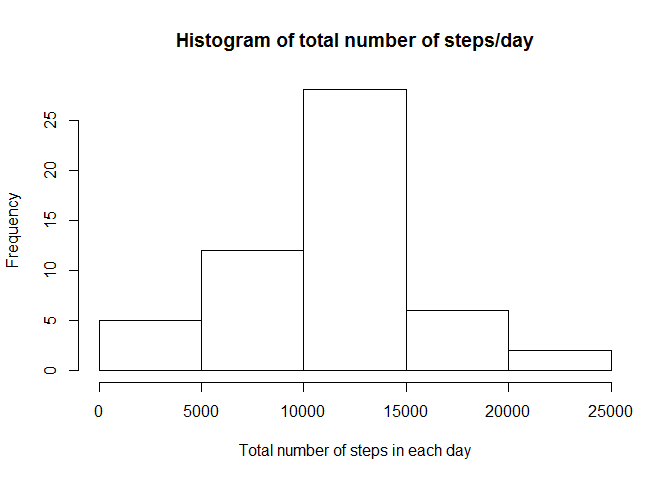
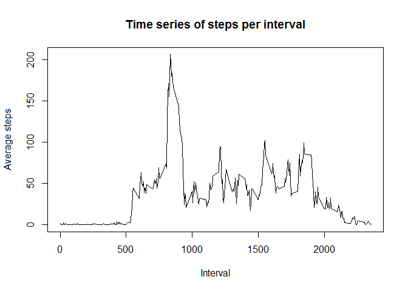
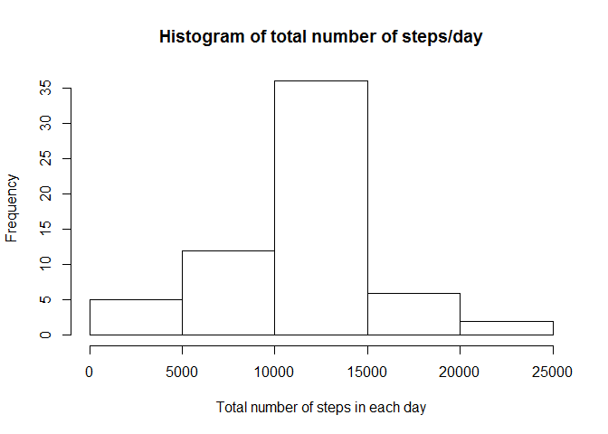
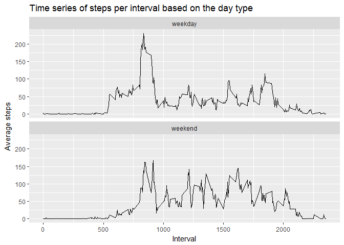

# Reproducible Research: Peer Assessment 1


## Summary

In this report we will describe the steps taken to answer the questions as well as the code and the results.

## Loading the required packages to process the data


```r
# install.packages("dplyr", repos="http://cran.ca.r-project.org") # uncomment if needed: cran has to be set to install the library
library(data.table)
library(dplyr)
```

```
## Warning: package 'dplyr' was built under R version 3.3.3
```

```
## -------------------------------------------------------------------------
```

```
## data.table + dplyr code now lives in dtplyr.
## Please library(dtplyr)!
```

```
## -------------------------------------------------------------------------
```

```
## 
## Attaching package: 'dplyr'
```

```
## The following objects are masked from 'package:data.table':
## 
##     between, first, last
```

```
## The following objects are masked from 'package:stats':
## 
##     filter, lag
```

```
## The following objects are masked from 'package:base':
## 
##     intersect, setdiff, setequal, union
```

```r
library(ggplot2)
```

## Loading and preprocessing the data
The data are loaded using the following command from the local .zip file in the cloned repository:


```r
#unzip("activity.zip") # Uncomment if needed (so it does not unzip the data automatically)
dat <- data.table(read.csv("activity.csv"))
summary(dat)
```

```
##      steps                date          interval     
##  Min.   :  0.00   2012-10-01:  288   Min.   :   0.0  
##  1st Qu.:  0.00   2012-10-02:  288   1st Qu.: 588.8  
##  Median :  0.00   2012-10-03:  288   Median :1177.5  
##  Mean   : 37.38   2012-10-04:  288   Mean   :1177.5  
##  3rd Qu.: 12.00   2012-10-05:  288   3rd Qu.:1766.2  
##  Max.   :806.00   2012-10-06:  288   Max.   :2355.0  
##  NA's   :2304     (Other)   :15840
```

```r
# names(dat)
```

## What is mean total number of steps taken per day?


```r
dat_day <- group_by(dat[!is.na(dat$steps),], date)
tot_steps_day <- summarise(dat_day, tot_num = sum(steps))
#tot_steps_day
summary(tot_steps_day)
```

```
##          date       tot_num     
##  2012-10-02: 1   Min.   :   41  
##  2012-10-03: 1   1st Qu.: 8841  
##  2012-10-04: 1   Median :10765  
##  2012-10-05: 1   Mean   :10766  
##  2012-10-06: 1   3rd Qu.:13294  
##  2012-10-07: 1   Max.   :21194  
##  (Other)   :47
```

```r
# histogram of total number of steps per day
hist(tot_steps_day$tot_num, main = "Histogram of total number of steps/day", 
     xlab = "Total number of steps in each day")
```

<!-- -->

```r
# mean of total number of steps per day
mean(tot_steps_day$tot_num)
```

```
## [1] 10766.19
```

```r
# median and median of total number of steps per day
median(tot_steps_day$tot_num)
```

```
## [1] 10765
```

## What is the average daily activity pattern?


```r
dat_int <- aggregate(steps ~ interval, dat, mean)
plot(dat_int$interval, dat_int$steps, type = "l", main = "Time series of steps per interval", 
     xlab = "Interval", ylab = "Average steps")
```

<!-- -->

```r
# The interval with max number of steps:
dat_int[which.max(dat_int$steps), ]
```

```
##     interval    steps
## 104      835 206.1698
```
Interval 835 has the maximum number of steps.

## Imputing missing values


```r
# number of rows with missing data
sum(is.na(dat))
```

```
## [1] 2304
```

```r
# Filling in the missing values with the mean for that 5-minute interval
dat_impt <- dat
for (i in 1:nrow(dat)){
  if (is.na(dat[i, 1])){
    dat_impt$steps[i] = dat_int[  dat_int$interval == dat$interval[i], 2  ]
  }
}
# dat_impt datset is the new dataset with missing data filled in:
head(dat_impt)
```

```
##        steps       date interval
## 1: 1.7169811 2012-10-01        0
## 2: 0.3396226 2012-10-01        5
## 3: 0.1320755 2012-10-01       10
## 4: 0.1509434 2012-10-01       15
## 5: 0.0754717 2012-10-01       20
## 6: 2.0943396 2012-10-01       25
```

```r
# histogram of total steps per day
impt_dat_day <- group_by(dat_impt, date)
tot_steps_day <- summarise(impt_dat_day, tot_num = sum(steps))
#tot_steps_day
summary(tot_steps_day)
```

```
##          date       tot_num     
##  2012-10-01: 1   Min.   :   41  
##  2012-10-02: 1   1st Qu.: 9819  
##  2012-10-03: 1   Median :10766  
##  2012-10-04: 1   Mean   :10766  
##  2012-10-05: 1   3rd Qu.:12811  
##  2012-10-06: 1   Max.   :21194  
##  (Other)   :55
```

```r
# histogram of total number of steps per day
hist(tot_steps_day$tot_num, main = "Histogram of total number of steps/day", 
     xlab = "Total number of steps in each day")
```

<!-- -->

```r
mean(tot_steps_day$tot_num)
```

```
## [1] 10766.19
```

```r
# median and median of total number of steps per day
median(tot_steps_day$tot_num)
```

```
## [1] 10766.19
```
Comparing the results with the results in the first part, mean stays the same, and median is slightly changed.

## Are there differences in activity patterns between weekdays and weekends?

Creating a new factor variable in the dataset with two levels - "weekday" and "weekend" indicating whether a given date is a weekday or weekend day:


```r
dat_impt$day_type <- weekdays(as.Date(dat_impt$date))
head(dat_impt)
```

```
##        steps       date interval day_type
## 1: 1.7169811 2012-10-01        0   Monday
## 2: 0.3396226 2012-10-01        5   Monday
## 3: 0.1320755 2012-10-01       10   Monday
## 4: 0.1509434 2012-10-01       15   Monday
## 5: 0.0754717 2012-10-01       20   Monday
## 6: 2.0943396 2012-10-01       25   Monday
```

```r
dat_impt$day_type[dat_impt$day_type %in% c('Saturday','Sunday') ] <- 'weekend'
dat_impt$day_type[ dat_impt$day_type != 'weekend' ] <- 'weekday'
head(dat_impt)
```

```
##        steps       date interval day_type
## 1: 1.7169811 2012-10-01        0  weekday
## 2: 0.3396226 2012-10-01        5  weekday
## 3: 0.1320755 2012-10-01       10  weekday
## 4: 0.1509434 2012-10-01       15  weekday
## 5: 0.0754717 2012-10-01       20  weekday
## 6: 2.0943396 2012-10-01       25  weekday
```

```r
dat_impt$day_type <- as.factor(dat_impt$day_type)

# Plotting
dat_dayt <- aggregate(steps ~ interval + day_type, dat_impt, mean)
g <- ggplot(dat_dayt, aes(interval, steps))
g + geom_line() + facet_wrap(~ day_type, nrow = 2) + labs(title = "Time series of steps per interval based on the day type") + labs(x= "Interval") + labs(y = "Average steps")
```

<!-- -->


